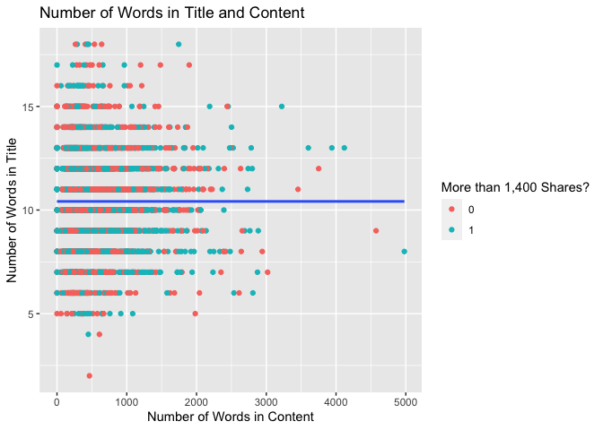
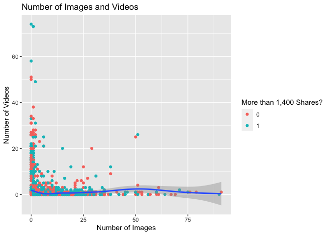
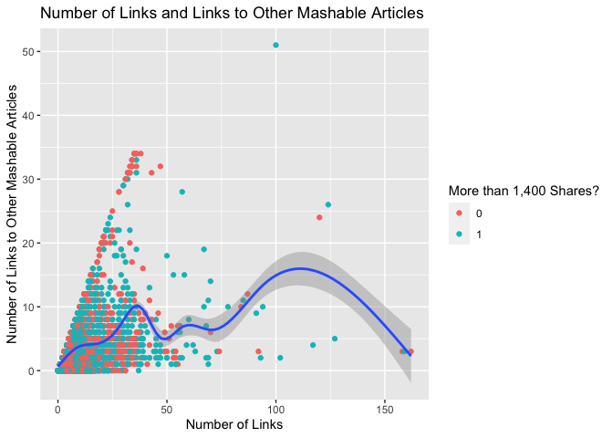
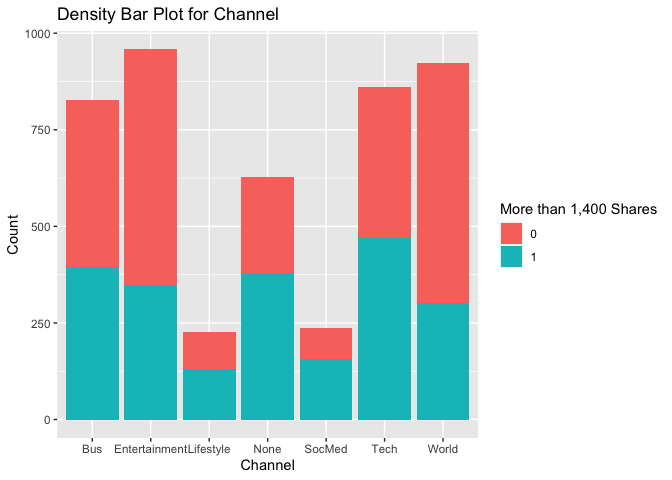

ST558 Project 2
================
Michael Evans
7/3/2020

  - [Introduction](#introduction)
      - [Description of Data](#description-of-data)
      - [Purpose of Analysis](#purpose-of-analysis)
      - [Methods](#methods)
  - [Reading Data](#reading-data)
      - [Initial Read](#initial-read)
      - [Creating New Variables](#creating-new-variables)
      - [Select Variables](#select-variables)
      - [Split into Train/Test Data](#split-into-traintest-data)
  - [Summarizations](#summarizations)
      - [Summary Statistics](#summary-statistics)
          - [Contingency Table](#contingency-table)
          - [Numerical Summary](#numerical-summary)
      - [Plots](#plots)
          - [Number of Words in Title and
            Content](#number-of-words-in-title-and-content)
          - [Number of Images and Videos](#number-of-images-and-videos)
          - [Number of Links and Links to Other Mashable
            Articles](#number-of-links-and-links-to-other-mashable-articles)
          - [Count of Data Channel](#count-of-data-channel)
  - [Modeling](#modeling)
      - [Logistic Regression Model](#logistic-regression-model)
      - [Bagged Trees Model](#bagged-trees-model)
  - [Modeling Results](#modeling-results)
      - [Logistic Regression Model](#logistic-regression-model-1)
          - [Logistic Regression Model
            Results](#logistic-regression-model-results)
      - [Bagged Trees Model](#bagged-trees-model-1)
          - [Bagged Trees Model Results](#bagged-trees-model-results)
  - [Conclusion](#conclusion)

# Introduction

In this report, we will be analyzing an online news data set for Monday.
The goal of this report is to predict the number of `shares` an article
will receive based on other characteristics of the article.

## Description of Data

The data comes from the UCI Machine Learning Repository and gives
information about the features of articles published by Mashable. We
will be analyzing the following variables in this report:

1.  `n_tokens_title`: a numeric variable indicating the number of words
    in the title.  
2.  `n_tokens_content`: a numeric variable indicating the number of
    words in the body of the article.  
3.  `num_hrefs`: a numeric variable indicating the number of links used
    in the article.  
4.  `num_self_hrefs`: a numeric variable indicating the numbers of links
    to other Mashable articles.  
5.  `num_imgs`: a numeric variable indicating the number of images used
    in the article.  
6.  `num_videos`: a numeric variable indicating the number of videos
    used in the article.  
7.  `channel`: a factor variable indicating the data channel. This
    variable is derived from the `data_channel_is_*` variables in the
    original data set. It has seven levels: lifestyle, entertainment,
    business, socmed, tech, world, and none.  
8.  `shares_1400`: a factor variables indicating whether or not an
    article received more than 1,400 shares. This variable is derived
    from the `shares` variable in the original data set.

## Purpose of Analysis

The purpose of this analysis is to predict the variable `shares_1400`
based on the other seven variables given. As previously mentioned,
`shares_1400` is a variable that indicates whether or not an article
received more than 1,400 shares.

The shares an article receives is usually indicative of how popular an
article is. Mashable, being a content producer, obviously wants to
produce popular content. Thus, it is important for them to be able to
identify what impacts how popular an article will be for them.

## Methods

This analysis will highlight two methods of modeling: an ensemble model
and a linear regression model. The ensemble model used in this analysis
will be a bagged trees model. The linear regression model used in this
analysis will be a logistic regression model.

As the name suggests, the bagged trees method is a tree based method,
meaning it uses regression/classification trees. In our case, it will be
utilizing a classification tree since `shares_1400` is a class variable.
The bagged method averages among multiple trees in order to decrease
variance compared to using one tree. This method also utilizes
bootstrapping aggregation to resample from the data multiple times and
apply some methodology to that sample.

The logistic regression model will be used to model our response
`shares_1400` as a success (more than 1,400 shares) or failure (less
than 1,400 shares). The logistic regression model returns the
probability of of success for a given observation. A value of 1 would
indicate the model is certain that an article will get more than 1,400
shares, and a value of 0 would indicate the model is certain that an
article will get less than 1,400 shares.

# Reading Data

The analysis will begin by reading in the data about Mashable’s
articles. We will start by reading in the entire data set, then doing
some data manipulating, subsetting, and filtering, and then splitting
the data into a training and testing set.

## Initial Read

We’ll read the initial data set in with `read_csv()`. Then, we will use
a combination of `mutate()` and `case_when()` from `dplyr` to create a
variable called `Weekday` that tells which day of the week it is. Then,
using our parameter `weekday` we will filter for the given weekday to
return only observations regarding that weekday.

``` r
#Read Data
news <- read_csv("OnlineNewsPopularity.csv")

#Add column that tells which weekday it is
news <- news %>%
    mutate(Weekday = case_when(weekday_is_monday ==  1 ~ 'Monday',
                               weekday_is_tuesday ==  1 ~ 'Tuesday',
                               weekday_is_wednesday ==  1 ~ 'Wednesday',
                               weekday_is_thursday ==  1 ~ 'Thursday',
                               weekday_is_friday ==  1 ~ 'Friday',
                               weekday_is_saturday ==  1 ~ 'Saturday',
                               weekday_is_sunday ==  1 ~ 'Sunday'))

#Get News for One Day
daily_news <- news %>% filter(Weekday == params$weekday) %>% 
  select(-(weekday_is_monday:weekday_is_sunday))
```

## Creating New Variables

Next, we will create the `shares_1400` variable that indicates whether
or not an article received more than 1,400 shares. We will also create a
variable called `channel` that indicates the data channel for a given
observation. This will be created using `mutate()` and `case_when()` in
combination with the `data_channel_is_*` variables.

``` r
#Make Shares into Factor
daily_news$shares_1400 <- ifelse(daily_news$shares > 1400, 1, 0)
daily_news$shares_1400 <- as.factor(daily_news$shares_1400)

#Create Variable for Channel Type
daily_news <- daily_news %>%
    mutate(channel = case_when(data_channel_is_lifestyle ==  1 ~ 'Lifestyle',
                               data_channel_is_entertainment ==  1 ~ 'Entertainment',
                               data_channel_is_bus ==  1 ~ 'Bus',
                               data_channel_is_socmed ==  1 ~ 'SocMed',
                               data_channel_is_tech ==  1 ~ 'Tech',
                               data_channel_is_world ==  1 ~ 'World'))

#Replace NA Values with "None"
daily_news$channel <- daily_news$channel %>% replace_na("None")

#Make Factor
daily_news$channel <- as.factor(daily_news$channel)
```

## Select Variables

Next, we will use the `select()` function to select the 8 variables of
interest for this analysis.

``` r
#Select Variables
daily_news <-daily_news %>% select(n_tokens_title, n_tokens_content, num_hrefs:num_videos, shares_1400, channel)
```

## Split into Train/Test Data

Finally, we will use the `sample()` function to split the initial data
into a training a testing set. The training set will include 70% of the
initial data, while the testing set will include the other 30%. We’ll
also use the `set.seed()` function to make the results of this report
reproducible.

``` r
#Split into Training and Testing Set
set.seed(321)
train <- sample(1:nrow(daily_news), size = nrow(daily_news) * 0.7)
test <- setdiff(1:nrow(daily_news), train)

#Subset data
daily_train <- daily_news[train, ]
daily_test <- daily_news[test, ]
```

# Summarizations

In this section of the report, we will look at some summary statistics
for our variables, as well as some basic plots.

## Summary Statistics

### Contingency Table

In our first summary, we will generate a contingency table to show the
number of articles that get more or less than 1,400 shares based on the
data channel the article falls under.

``` r
#Create Contingency Table
table.1 <- table(daily_train$shares_1400, daily_train$channel)

#Rename Rows
rownames(table.1) <- c("More Than 1,400 Shares", "Less Than 1,400 Shares")

#Create Kable
kable(table.1, caption = "Shares vs. Data Channel")
```

|                        | Bus | Entertainment | Lifestyle | None | SocMed | Tech | World |
| ---------------------- | --: | ------------: | --------: | ---: | -----: | ---: | ----: |
| More Than 1,400 Shares | 432 |           611 |        95 |  250 |     81 |  389 |   622 |
| Less Than 1,400 Shares | 395 |           347 |       132 |  379 |    156 |  471 |   302 |

Shares vs. Data Channel

### Numerical Summary

Next, we will use the `summary()` function to get summary information
for each of our numerical variables. Summary information will include
the minimum, first quantile, median, mean, third quantile, and maximum
observations within each variable.

``` r
#Create Sumamry
summary <- daily_train %>% select(n_tokens_title:num_videos) %>% summary()
summary
```

    ##  n_tokens_title  n_tokens_content   num_hrefs      num_self_hrefs      num_imgs        num_videos    
    ##  Min.   : 2.00   Min.   :   0.0   Min.   :  0.00   Min.   : 0.000   Min.   : 0.000   Min.   : 0.000  
    ##  1st Qu.: 9.00   1st Qu.: 250.0   1st Qu.:  4.00   1st Qu.: 1.000   1st Qu.: 1.000   1st Qu.: 0.000  
    ##  Median :10.00   Median : 407.0   Median :  8.00   Median : 3.000   Median : 1.000   Median : 0.000  
    ##  Mean   :10.42   Mean   : 544.7   Mean   : 10.82   Mean   : 3.452   Mean   : 4.499   Mean   : 1.289  
    ##  3rd Qu.:12.00   3rd Qu.: 720.0   3rd Qu.: 14.00   3rd Qu.: 4.000   3rd Qu.: 3.000   3rd Qu.: 1.000  
    ##  Max.   :18.00   Max.   :4979.0   Max.   :162.00   Max.   :51.000   Max.   :91.000   Max.   :74.000

## Plots

### Number of Words in Title and Content

In this graph, we will look at the relationship between the number of
words in the title and number of words in the content of an article. By
coloring by whether or not an article has more than 1,400 shares, we
will also be able to see any trends that exist among popular articles.
An interesting finding would be whether or not more or less words lead
to more popular articles.

``` r
#First Visual
visuals.1 <- ggplot(data = daily_train, aes(x = n_tokens_content, y = n_tokens_title))
visuals.1 + geom_point(aes(color = shares_1400)) +
  geom_smooth() + 
  labs(color = "More than 1,400 Shares?", title = "Number of Words in Title and Content",
       x = "Number of Words in Content", y = "Number of Words in Title") 
```

    ## `geom_smooth()` using method = 'gam' and formula 'y ~ s(x, bs = "cs")'

<!-- -->

### Number of Images and Videos

In this graph, we will look at the relationship between the number of
images and number of videos in an article. By coloring by whether or not
an article has more than 1,400 shares, we will also be able to see any
trends that exist among popular articles. An interesting finding would
be whether or not more images/videos leads to more popular articles.

``` r
#Second Visual
visuals.2 <- ggplot(data = daily_train, aes(x = num_imgs, y = num_videos))
visuals.2 + geom_point(aes(color = shares_1400)) +
  geom_smooth() + 
  labs(color = "More than 1,400 Shares?", title = "Number of Images and Videos",
       x = "Number of Images", y = "Number of Videos") 
```

    ## `geom_smooth()` using method = 'gam' and formula 'y ~ s(x, bs = "cs")'

<!-- -->

### Number of Links and Links to Other Mashable Articles

In this graph, we will look at the relationship between the number of
links in an article and the number of links to other Mashable articles.
This will give insights as to whether or not Mashable is using most of
its links to link to itself, which would be evident from a positive
linear relationship. By coloring by whether or not an article has more
than 1,400 shares, we will also be able to see any trends that exist
among popular articles.

``` r
#Third Visual
visuals.3 <- ggplot(data = daily_train, aes(x = num_hrefs, y = num_self_hrefs))
visuals.3 + geom_point(aes(color = shares_1400)) +
  geom_smooth() + 
  labs(color = "More than 1,400 Shares?", 
       title = "Number of Links and Links to Other Mashable Articles",
       x = "Number of Links", y = "Number of Links to Other Mashable Articles") 
```

    ## `geom_smooth()` using method = 'gam' and formula 'y ~ s(x, bs = "cs")'

<!-- -->

### Count of Data Channel

In this graph, we will look at the number of articles posted in each
data channel. Within each data channel, we can see the proportion of
articles receiving more than 1,400 shares. This will help us determine
whether or not a channel performs better than others.

``` r
#Fourth Visual
visuals.4 <- ggplot(data = daily_train, aes(x = channel))
visuals.4 + geom_bar(aes(fill = shares_1400)) +
  labs(title = "Density Bar Plot for Channel", x = "Channel", y = "Count", 
       fill = "More than 1,400 Shares")
```

<!-- -->

# Modeling

In this section of the report, we will create our logistic regression
model and bagged trees model.

## Logistic Regression Model

Logistic regression models will be created using the `glm()` function.
In comparing logistic regression model, the AIC will be compared. The
smaller the AIC, the better. It accounts for how well the model fits the
data but also penalizes for overly complex models. We will choose the
model with the smallest AIC.

For this analysis, we will investigate five different logistic models,
summarized below:  
1\. Using all 7 predictor variables to predict `shares_1400`.  
2\. Using variables relating to number of words to predict `shares_1400`
(`n_tokens_title`, `n_tokens_content`).  
3\. Using variables relating to links to predict `shares_1400`
(`num_hrefs`, `num_self_hrefs`).  
4\. Using variables relating to media to predict `shares_1400`
(`num_imgs`, `num_videos`).  
5\. Using variables relating to data channel to predict `shares_1400`
(`channel`).

We will use the function `which.min()` to determine the model with the
smallest AIC. Then, we will use an if else chain to save the object
`best_model` as the model with the lowest AIC.

``` r
#First Model
glm_fit1 <- glm(shares_1400 ~., 
                data = daily_train, family = "binomial")
#AIC
glm_fit1$aic
```

    ## [1] 6192.16

``` r
#Second Model
glm_fit2 <- glm(shares_1400 ~ n_tokens_title + n_tokens_content, 
                data = daily_train, family = "binomial")
#AIC
glm_fit2$aic
```

    ## [1] 6442.387

``` r
#Third Model
glm_fit3 <- glm(shares_1400 ~ num_hrefs + num_self_hrefs, 
                data = daily_train, family = "binomial")
#AIC
glm_fit3$aic
```

    ## [1] 6407.756

``` r
#Fourth Model
glm_fit4 <- glm(shares_1400 ~ num_imgs + num_videos, 
                data = daily_train, family = "binomial")
#AIC
glm_fit4$aic
```

    ## [1] 6437.802

``` r
#Fifth Model
glm_fit5 <- glm(shares_1400 ~  channel, 
                data = daily_train, family = "binomial")
#AIC
glm_fit5$aic
```

    ## [1] 6223.715

``` r
#All Models
glm_models <- c(Model1 = glm_fit1$aic, Model2 = glm_fit2$aic, Model3 = glm_fit3$aic, 
                Model4 = glm_fit4$aic, Model5 = glm_fit5$aic)

#Find Model with Smallest AIC
min <- which.min(glm_models)

#Save Best Model
if(min == 1){
  best_model = glm_fit1
} else if(min == 2){
    best_model = glm_fit2
} else if(min == 3){
    best_model = glm_fit3
} else if(min == 4){
    best_model = glm_fit4
} else if(min == 5){
    best_model = glm_fit5
}

#Summary of Best Model
best_model
```

    ## 
    ## Call:  glm(formula = shares_1400 ~ ., family = "binomial", data = daily_train)
    ## 
    ## Coefficients:
    ##          (Intercept)        n_tokens_title      n_tokens_content             num_hrefs        num_self_hrefs  
    ##           -0.1798814            -0.0044694             0.0000686             0.0184295            -0.0291518  
    ##             num_imgs            num_videos  channelEntertainment      channelLifestyle           channelNone  
    ##            0.0024836             0.0019212            -0.5001688             0.3495767             0.4400972  
    ##        channelSocMed           channelTech          channelWorld  
    ##            0.7470150             0.3438890            -0.6645602  
    ## 
    ## Degrees of Freedom: 4661 Total (i.e. Null);  4649 Residual
    ## Null Deviance:       6444 
    ## Residual Deviance: 6166  AIC: 6192

## Bagged Trees Model

The bagged trees model will be created using the `train()` function.
With this method, there is no tuning parameter, but we will still used
10-fold cross-validation to select the bagged trees model. The point of
10-fold cross-validation is to split the original training set into
subsets to train the model on and test the model on. In 10-fold
cross-validation, 1 subset would be used for testing, and 9 would be
used for training. All of the results are then averaged in creating the
final model.

``` r
#Create Model
bagged_tree <- train(shares_1400 ~ ., data = daily_train, method = "treebag",
                     trControl = trainControl(method = "cv", number = 10))

#View Model
bagged_tree
```

    ## Bagged CART 
    ## 
    ## 4662 samples
    ##    7 predictor
    ##    2 classes: '0', '1' 
    ## 
    ## No pre-processing
    ## Resampling: Cross-Validated (10 fold) 
    ## Summary of sample sizes: 4196, 4195, 4196, 4196, 4196, 4196, ... 
    ## Resampling results:
    ## 
    ##   Accuracy   Kappa    
    ##   0.5742039  0.1431394

# Modeling Results

In this section of the report, we will look at the results of our models
and compare their accuracy on our test set of data.

## Logistic Regression Model

We will use the `predict()` function with our logistic model to predict
whether or not an article will get more than 1,400 shares. The output
will be rounded in order to convert to either a 0 (less than 1,400
shares) or 1 (more than 1,400 shares). The `confusionMatrix` function
will be used to compare the prediction values to the actual values from
the test set.

``` r
glm_pred <- predict(best_model, newdata = daily_test)

#Round Output
glm_pred <- round(glm_pred, 0)

#Make Data Frame
glm_pred <- data.frame(glm_pred)
names(glm_pred) <- "shares_1400"

#Adjust for Bounds
glm_pred[,1][glm_pred[,1] < 0] <- 0
glm_pred[,1][glm_pred[,1] > 1] <- 1

#Create Levels
levels(glm_pred$shares_1400) <- c("0", "1")

#Make Factor
glm_pred$shares_1400 <- as.factor(glm_pred$shares_1400)

#Create Confusion Matrix
logistic_results <- confusionMatrix(glm_pred$shares_1400, daily_test$shares_1400)
logistic_results
```

    ## Confusion Matrix and Statistics
    ## 
    ##           Reference
    ## Prediction   0   1
    ##          0 993 783
    ##          1  48 175
    ##                                          
    ##                Accuracy : 0.5843         
    ##                  95% CI : (0.5623, 0.606)
    ##     No Information Rate : 0.5208         
    ##     P-Value [Acc > NIR] : 6.708e-09      
    ##                                          
    ##                   Kappa : 0.1409         
    ##                                          
    ##  Mcnemar's Test P-Value : < 2.2e-16      
    ##                                          
    ##             Sensitivity : 0.9539         
    ##             Specificity : 0.1827         
    ##          Pos Pred Value : 0.5591         
    ##          Neg Pred Value : 0.7848         
    ##              Prevalence : 0.5208         
    ##          Detection Rate : 0.4967         
    ##    Detection Prevalence : 0.8884         
    ##       Balanced Accuracy : 0.5683         
    ##                                          
    ##        'Positive' Class : 0              
    ## 

### Logistic Regression Model Results

The logistic regression model has an accuracy of 0.5842921.

## Bagged Trees Model

We will use the `predict()` function with our bagged trees model to
predict whether or not an article will get more than 1,400 shares. The
`confusionMatrix` function will be used to compare the prediction values
to the actual values from the test set.

``` r
#Predict Bagged Tree
bagged_pred <- predict(bagged_tree, daily_test)

#Create Results
bagged_results <- confusionMatrix(data = bagged_pred, reference = daily_test$shares_1400)
bagged_results
```

    ## Confusion Matrix and Statistics
    ## 
    ##           Reference
    ## Prediction   0   1
    ##          0 672 439
    ##          1 369 519
    ##                                           
    ##                Accuracy : 0.5958          
    ##                  95% CI : (0.5739, 0.6174)
    ##     No Information Rate : 0.5208          
    ##     P-Value [Acc > NIR] : 9.123e-12       
    ##                                           
    ##                   Kappa : 0.1878          
    ##                                           
    ##  Mcnemar's Test P-Value : 0.01521         
    ##                                           
    ##             Sensitivity : 0.6455          
    ##             Specificity : 0.5418          
    ##          Pos Pred Value : 0.6049          
    ##          Neg Pred Value : 0.5845          
    ##              Prevalence : 0.5208          
    ##          Detection Rate : 0.3362          
    ##    Detection Prevalence : 0.5558          
    ##       Balanced Accuracy : 0.5936          
    ##                                           
    ##        'Positive' Class : 0               
    ## 

### Bagged Trees Model Results

The bagged trees model has an accuracy of 0.5957979.

# Conclusion

``` r
better <- ifelse(bagged_results[["overall"]][["Accuracy"]] > logistic_results[["overall"]][["Accuracy"]],
                 "Bagged Trees Model", "Logistic Regression Model")

better_accuracy <- ifelse(better == "Bagged Trees Model", bagged_results[["overall"]][["Accuracy"]], 
       logistic_results[["overall"]][["Accuracy"]])
```

With an accuracy of 0.5957979, we conclude that the Bagged Trees Model
is better at predicting whether or not a Mashable article will get more
or less than 1,400 shares.

However, as a whole, we note that both models are not particularly great
at predicting whether or not an article will get more than 1,400 shares.
This could be because the variables that were selected for exploration
in this project are not the most important variables in making this
prediction. Without doing a more extensive analysis, it is hard to say.

This analysis is still important for showing the different ways that
models can be created. If one were looking to get more complex, further
methods for choosing variables for analysis and the regression model
could be investigated. One could also look at building a model based on
random forests or boosted trees to compare the results of those methods.
